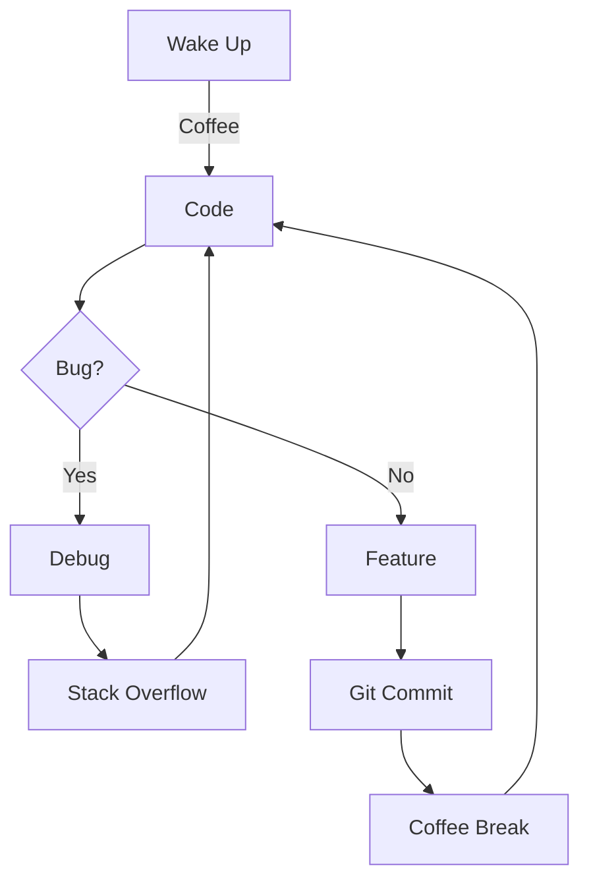

<h1 align="center">
   Hey there! I'm Omkar
</h1>

<div align="center">
  
</div>

###  A Little Bit About Me...  

```typescript
class Omkar extends Developer {
    constructor() {
        super();
        this.name = "Omkar Kamble";
        this.role = "Full Stack Developer";
        this.languageSpoken = ["hi_IN", "en_US"];
        this.currentlyLearning = "Advanced AI/ML 🤖";
        this.funFact = "I debug with console.log and I'm proud of it! 😄";
    }

    sayHi() {
        return "Thanks for dropping by! Let's build something amazing together! 🚀";
    }

    getLifeGoals() {
        return [
            "Build impactful tech solutions 💡",
            "Contribute to Open Source 🌟",
            "Share knowledge with community 📚",
            "Never stop learning 🎯"
        ];
    }
}
```


### 🧙‍♂️ Tech Arsenal

<div align="left">
<details>
<summary>Click to expand! 🚀</summary>

#### Frontend Sorcery 🎨


#### Backend Wizardry ⚡


#### AI Enchantments 🧠


</details>
</div>

### 🚀 Current Quest: CourseI.AI

```jsx
const ProjectHighlight = () => {
  return (
    <div className="project">
      <h3>🎯 Mission</h3>
      <p>Revolutionizing learning with AI-powered course generation</p>
      
      <h3>⚡ Impact</h3>
      <ul>
        <li>1000+ daily active learners</li>
        <li>90% satisfaction rate</li>
        <li>75% faster course creation</li>
      </ul>
      
      <h3>🛠️ Built With</h3>
      <p>Next.js • Gemini API • Drizzle ORM • ❤️</p>
    </div>
  );
};
```

### 🎮 GitHub Stats Game

<div align="center">
  
</div>

<div align="center">
  
  
</div>

### 🎵 Coding Playlist

<div align="center">

| Mood | Track |
|------|-------|
| 🎯 Focus | Lofi Beats |
| 🐛 Debug | Metal 🤘 |
| 🚀 Launch | Eye of the Tiger |
| 💡 Planning | Classical Piano |

</div>

### 🌟 Weekly Dev Routine



### 📫 Let's Connect!

<div align="center">
  
[](https://linkedin.com/in/omkarspace)
[](https://github.com/omkarspace)
[](https://leetcode.com/omkarspace)

</div>

<div align="center">
  


</div>

<div align="center">
  
  
  
</div>


<div align="center">
  
</div>
